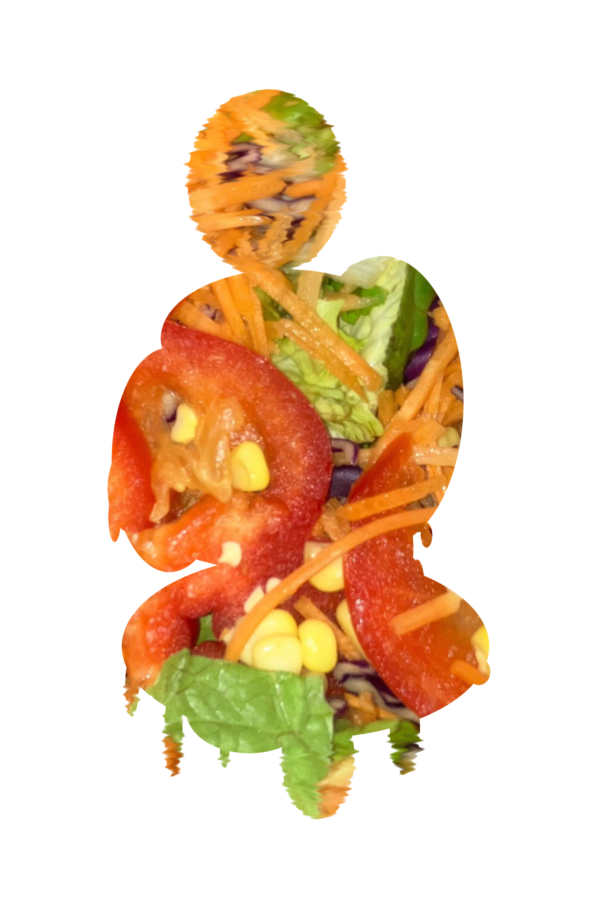

  
  <h1>SALADPUNK</h1>
  
  

    A game about salad... or is it?
  

<h4>
    <a href="https://freeformwave.itch.io/saladpunk/">View Demo</a>
   · 
    <a href="https://github.com/FreeformWave544/StoryForm/">Documentation</a>
   · 
    <a href="https://freeformwave.itch.io/saladpunk#comments">Report Bug/Request Feature</a>
   · 
    <a href="https://github.com/FreeformWave544/StoryForm/issues">GitHub issues</a>
  </h4>

 

# :notebook_with_decorative_cover: Table of Contents

- [About the Project](#star2-about-the-project)
  * [Screenshots](#camera-screenshots)
  * [Features](#dart-features)
- [Getting Started](#toolbox-getting-started)
  * [Installation](#gear-installation)
- [License](#warning-license)
- [Links](#handshake-links)
- [Acknowledgements](#gem-acknowledgements)

  

<!-- About the Project -->
## :star2: About the Project

SaladPunk. A surreal, branching Visual Novel (VN) littered with easter eggs, hidden systems, meta-narrative elements, and multiple intertwining storylines.  It is about helping James — and yourself — find Salad... but maybe you find something more? 
  And for part two, you take a dive into the sands of time, experiencing John's childhood second-hand, though the eyes of his older sibling. 
Who is John? Well you've got to play the game and pay attention to find that out.

<!-- Screenshots -->
### :camera: Screenshots

 
  
  
  
  

<!-- Features -->
### :dart: Features

- A mix of absurd comedy and introspective storytelling.
- Surreal, narrative-driven experience.
- Your voice — or more so your choice — matters.

<!-- Getting Started -->
## :toolbox: Getting Started

<!-- Installation -->
### :gear: Installation

I have _two_ versions of the game available!
- Part one of the game for week **ONE** of game-dev resolution.
- Part two of the game - contains BOTH week **one** AND **two**!

There is no need to install anything - it is web based!
You can access both versions here: [>>](#handshake-links)

<!-- License -->
## :warning: License

Distributed under the MIT License. See LICENSE.txt for more information.

<!-- Links -->
## :handshake: Links

- Part ONE: [GitHub Pages](https://freeformwave544.github.io/StoryForm/)
- Part TWO (+ one): [itch.io](https://freeformwave.itch.io/saladpunk/)

<!-- Acknowledgments -->
## :gem: Acknowledgements

What did I use?

 - [Godot](https://godotengine.org/)
 - [Awesome README Template](https://github.com/Louis3797/awesome-readme-template/blob/main/README.md?plain=1)
